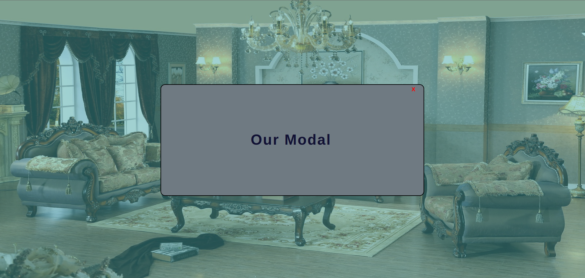

# MODAL PROJECT

## FULLSTACK PRACTICE PROJECT NO: 6

1. A fullstack version of my previous frontend project to practice my skills using Javascript, NodeJS, ExpressJS, HTML, CSS.

2. When we click to the button it filters the background and creates a new div elements inside modal div and a close button which works.

3. There is no modal image because it is just for practicing.
